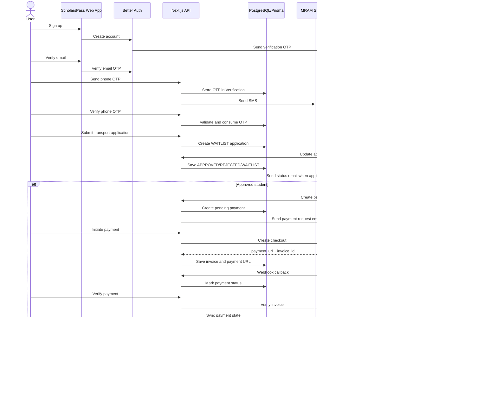
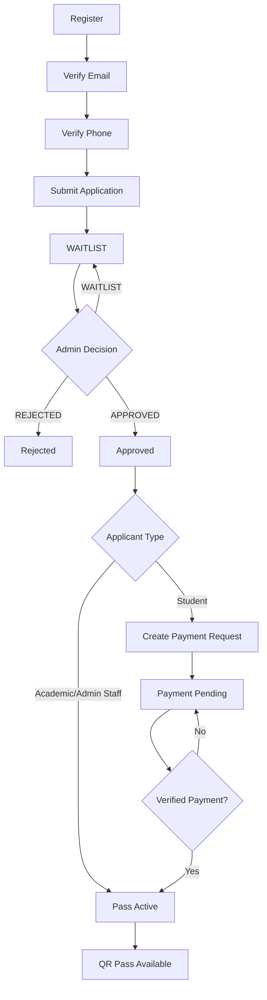
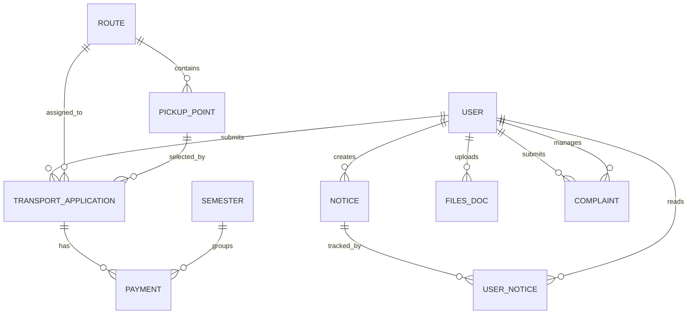
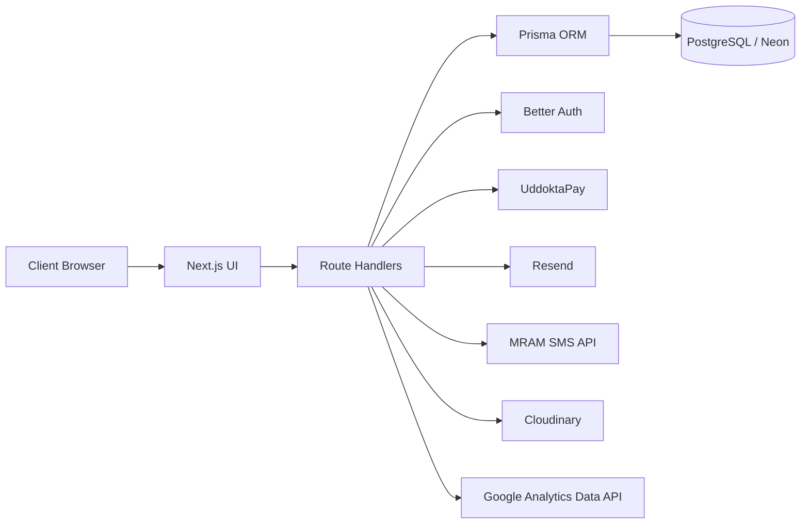

# Diagrams

## Sequence Diagram

```mermaid
sequenceDiagram
    actor User
    participant Web as ScholarsPass Web App
    participant Auth as Better Auth
    participant API as Next.js API
    participant DB as PostgreSQL/Prisma
    participant SMS as MRAM SMS API
    participant Pay as UddoktaPay
    participant Mail as Resend
    participant Admin

    User->>Web: Sign up
    Web->>Auth: Create account
    Auth->>Mail: Send verification OTP
    User->>Web: Verify email
    Web->>Auth: Verify email OTP

    User->>API: Send phone OTP
    API->>DB: Store OTP in Verification
    API->>SMS: Send SMS
    User->>API: Verify phone OTP
    API->>DB: Validate and consume OTP

    User->>API: Submit transport application
    API->>DB: Create WAITLIST application

    Admin->>API: Update application status
    API->>DB: Save APPROVED/REJECTED/WAITLIST
    API->>Mail: Send status email when applicable

    alt Approved student
        Admin->>API: Create payment request
        API->>DB: Create pending payment
        API->>Mail: Send payment request email
        User->>API: Initiate payment
        API->>Pay: Create checkout
        Pay-->>API: payment_url + invoice_id
        API->>DB: Save invoice and payment URL
        Pay->>API: Webhook callback
        API->>DB: Mark payment status
        User->>API: Verify payment
        API->>Pay: Verify invoice
        API->>DB: Sync payment state
    else Approved academic/admin staff
        Note over API,DB: No payment required
    end

    User->>Web: Open pass page
    Web->>DB: Load application and payments
    Web->>Web: Compute pass state and QR
```

## Flow Diagram

```mermaid
flowchart TD
    A[Register] --> B[Verify Email]
    B --> C[Verify Phone]
    C --> D[Submit Application]
    D --> E[WAITLIST]
    E --> F{Admin Decision}
    F -->|REJECTED| G[Rejected]
    F -->|WAITLIST| E
    F -->|APPROVED| H[Approved]
    H --> I{Applicant Type}
    I -->|Student| J[Create Payment Request]
    I -->|Academic/Admin Staff| M[Pass Active]
    J --> K[Payment Pending]
    K --> L{Verified Payment?}
    L -->|No| K
    L -->|Yes| M
    M --> N[QR Pass Available]
```

## ER Diagram

```mermaid
erDiagram
    USER ||--o{ TRANSPORT_APPLICATION : submits
    ROUTE ||--o{ PICKUP_POINT : contains
    ROUTE ||--o{ TRANSPORT_APPLICATION : assigned_to
    PICKUP_POINT ||--o{ TRANSPORT_APPLICATION : selected_by
    TRANSPORT_APPLICATION ||--o{ PAYMENT : has
    SEMESTER ||--o{ PAYMENT : groups
    USER ||--o{ NOTICE : creates
    NOTICE ||--o{ USER_NOTICE : tracked_by
    USER ||--o{ USER_NOTICE : reads
    USER ||--o{ FILES_DOC : uploads
    USER ||--o{ COMPLAINT : submits
    USER ||--o{ COMPLAINT : manages
```

## Architecture Diagram

```mermaid
flowchart LR
    A[Client Browser] --> B[Next.js UI]
    B --> C[Route Handlers]
    C --> D[Prisma ORM]
    D --> E[(PostgreSQL / Neon)]
    C --> F[Better Auth]
    C --> G[UddoktaPay]
    C --> H[Resend]
    C --> I[MRAM SMS API]
    C --> J[Cloudinary]
    C --> K[Google Analytics Data API]
```
